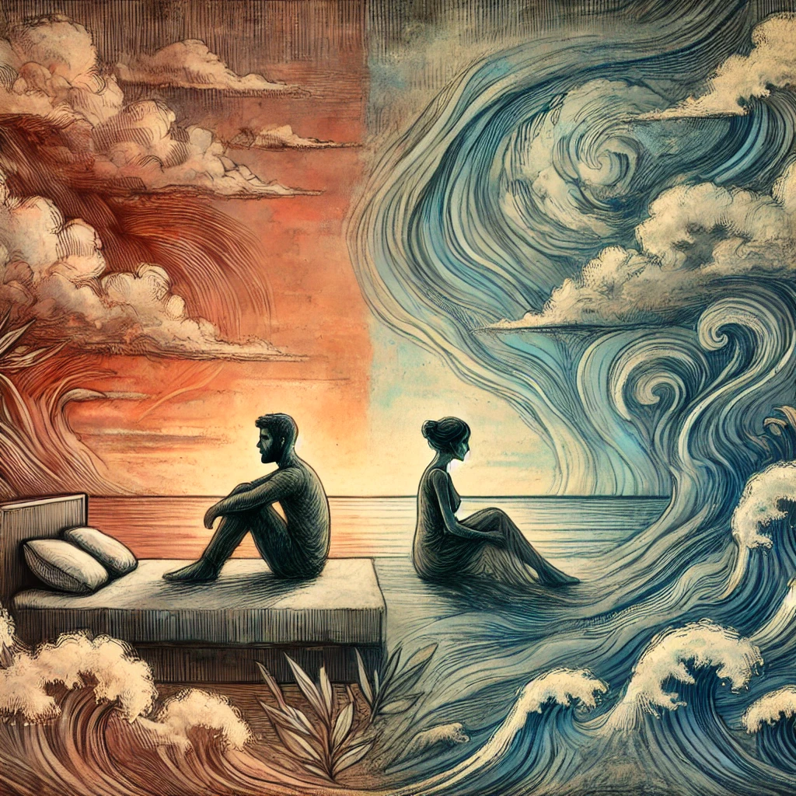

Κλαίω και με φιλάς

Πόσο θα γίνεται αυτό με εμάς;

Στο κρεβάτι κάθομαι και με κοιτάς

Ανάμεσα μας θάλασσες

Βουνά, πεδιάδες και εμπόδια

Αέρα πως φυσάς

Η σκέψη μου να φτάσει την δική σου προσπαθώ

Προσπάθησε και εσύ για εμάς

Κάποιες φορές θέλω ησυχία

Άλλες μια αγκαλιά

Ίσως και λίγη φασαρία

Νιώθω ένα βάρος στην καρδιά

Και με κουράζει ψυχικά

... είμαι νεκρός ...

Μόνο για κάποια δευτερόλεπτα

Με ξυπνάς πάλι μετά

Με δύο μάτια τόσο υπέροχα και ένα σωρό χαμόγελα

Αγαπά με χωρίς το χτες και το αύριο

Πόσο δύσκολο είναι να ζεις το τώρα

Ας κοιμηθούμε άλλη μια ώρα
