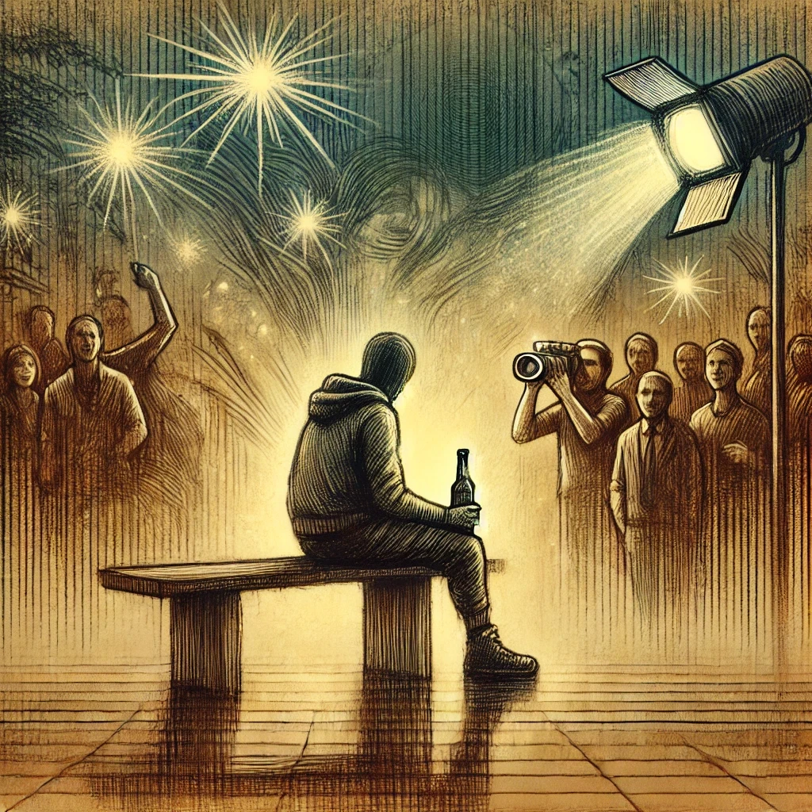

Πόσο καθαρή είναι η ψυχή σου;

Κουβαλάς όλες τις σκέψεις σου μαζί σου;

Η βρομιά του κόσμου απέραντη

Κάποια στιγμή θα ακουμπήσει

Θα σκεφτείς εμένα ή θα την αφήσεις

Λίγοι άνθρωποι και καλοί

Τους μιλάς και χαίρονται μαζί

Εσένα τι σε χαροποιεί;

Το έχεις ποτέ σκεφτεί;

Τα μαύρα αμάξια και οι οδηγοί;

Κάποια στιγμή όμως θα χρειαστεί

Aλλιώς οι σκέψεις σου και το μυαλό σου θα χαθεί

Μα εγώ θα είμαι εκεί

Σε μια παράλληλη όμως ζωή

Θα σε κοιτάω και θα χαίρομαι για κάθε σου στιγμή

Ίσως ότι ζήσαμε μαζί ν' αρκεί

Και κάπου στο μυαλό σου κατοικεί

Να τα σκέφτεσαι σε κάποια δύσκολη στιγμή

Και ίσως το πως θα ήμασταν μαζί

Μα το μυαλό σου πια δεν είναι εκεί

Κοιτάω τα μάτια σου και δεν σε αναγνωρίζω

Μα όλοι σε γνωρίζουν

Φωτογραφίες και αυτόγραφα

Η ζωή φαίνεται μαγική

Λεφτά να έρχονται από εδώ και από εκεί

Να σε ρωτάνε αν σου άρεσε και τι

Η τέχνη κάπου κείτεται νεκρή

Μα είναι όλοι υπέροχοι και φανταστικοί

Χειροκροτήματα, πυροτεχνήματα

Ψεύτικα γέλια και φιλοφρονήματα

Άκοσμα σχόλια και βλέμματα

Μην αγχώνεστε δεν θα έρθω

Δεν θα θυμάμαι

Δεν θα ακούω

Ούτε θα βλέπω

Καλά να περνάτε

Κάπου θα πίνω μια μπύρα και συγκαταβατικά μόνο θα γνέφω
