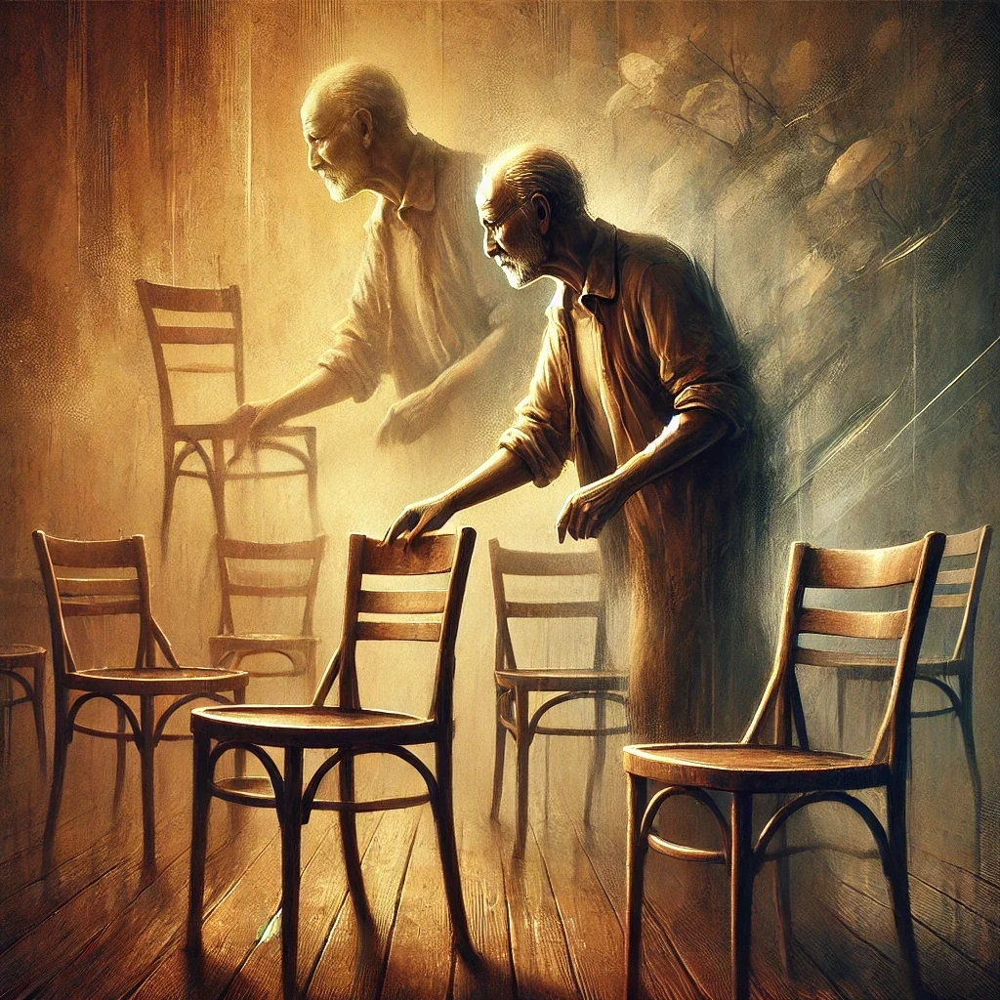

Μαζεύεις τις καρέκλες

Και ταλαιπωριέσαι

Έχεις νεύρα ή βοηθάς και ξεχνιέσαι

Σου έχει σταθεί κάνεις ποτέ

Ή βασανίζεσαι και αναρωτιέσαι;

Πουκάμισο και τσιγάρο

Είσαι ωραίος σκέφτεσαι

Ή το ξέρεις και καυχιέσαι;

Το πρόσωπο σκαμμένο

Ψηλός και ωραίος ήσουνα

Τώρα βλέπω έναν γερό τρομαγμένο

Που φοβίζει και τους γύρω του

Και τον εαυτό του περιμένω

Χρειάζεσαι αγάπη και νερό

Για να σε δω ευτυχισμένο
