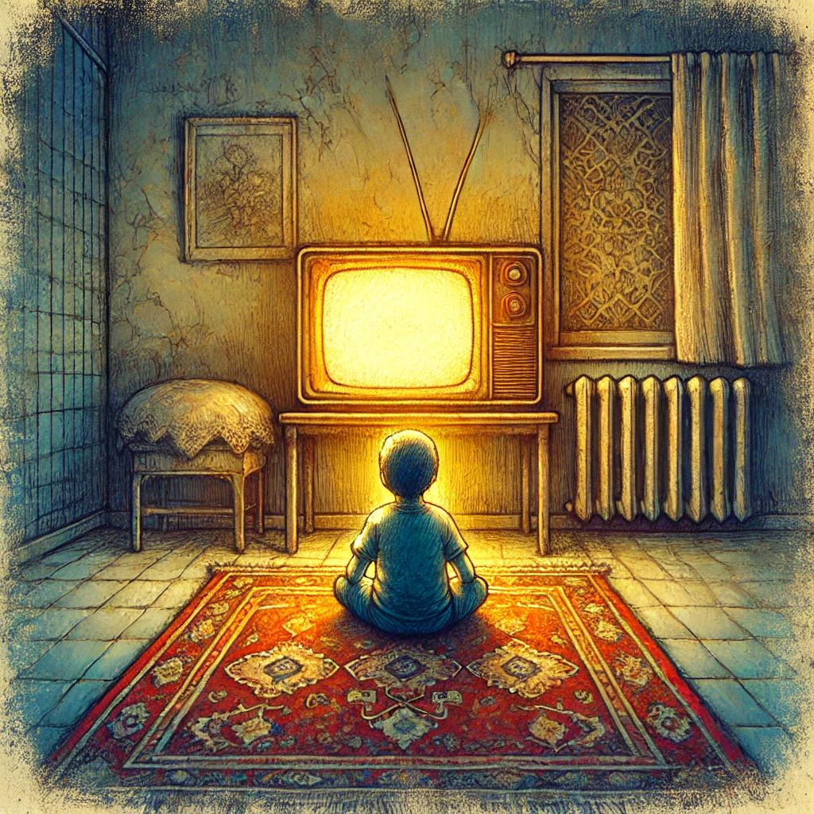

Θυμάσαι πως ένιωθες μικρό;

Το συναίσθημα αυτό

Με ενθουσιασμό να ξυπνάς

Στην τηλεόραση μπροστά

Κάτω κάθεσαι

Σε ένα χαλί πάνω, αν θυμάμαι

Το παιδικά να προλάβεις

Από νωρίς ξεκινάς

Η λέξη κούραση άγνωστη, ακόμα

Θα την γνωρίσεις όμως σύντομα

Πλέον μπορείς;

Νιώθεις έτσι;

Ή το ίδιο πρωί κάθε μέρα είναι πλέον

Χωρίς τηλεόραση

Κανέναν και ούτε εσένα πλέον δεν νοιάζει

Στα σπίτια πια δεν υπάρχει

Τα παιδικά ακόμα όμως παίζουν

Παιδικές ψυχές όμως δεν παίζουν
